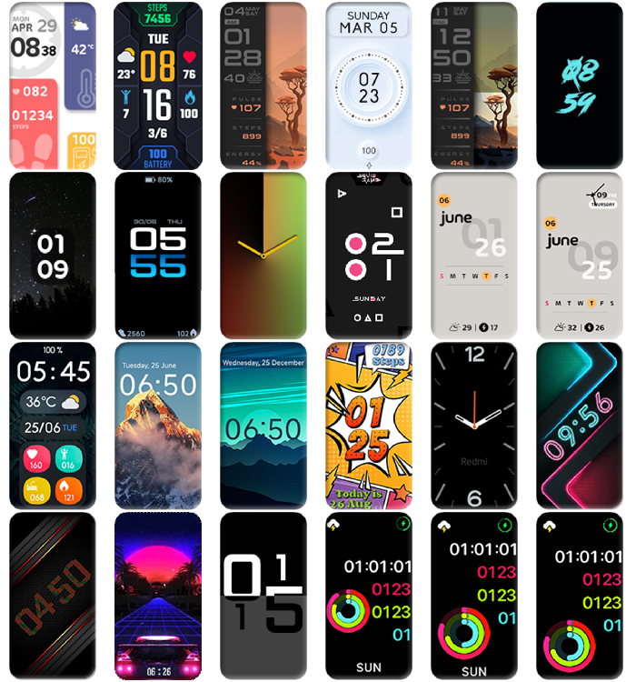

# Redmi Smart Band Pro Custom Watchfaces
Hey Redmi Smart Band Pro fans! :wave:

Tired of the same old watchfaces? :frowning_face: 

Looking for new watchfaces? :thinking:

Here I've created some cool custom ones for you! :wink:

Check them out and let me know if you want a custom one just for you. :innocent:

*Let's make your smartband even more smarter!* :partying_face:

# Watchface Gallery

<picture>
  <source media="(prefers-color-scheme: dark)" srcset="images/wf-dark-xawwnee.png">
  <source media="(prefers-color-scheme: light)" srcset="images/wf-light-xawwnee.jpg">
  
</picture>

# Get Started
### Install
> Send `/latestapp` command to [@mi_watch_bot](https://t.me/mi_watch_bot)

> Install latest version of MiFitness modded application (apk, under Android only)
  
> Open online watchfaces list.

> Install any watchface you want.

# Support
> Buy [@xawwnee](https://t.me/xawwnee) a coffee on [ko-fi.com/xawwnee](https://ko-fi.com/xawwnee)

# Extra
> Get more watchfaces for other Xiaomi/Redmi wearables on [@mi_watch_int](https://t.me/mi_watch_int)

# Credit
> EasFace - https://github.com/m0tral/EasyFace

> Redmi Smart Band Pro - https://amzn.to/3XYL35H

> Xiaomi / Redmi Smart Watch - https://amzn.to/4diDXgM

#

> [!WARNING]
> This app is shared for informational purposes only. I am not the app developer and cannot guarantee its functionality or security.
> 
> Use at your own discretion.

> [!CAUTION]
> Please be aware that installing third-party apps from other sources can pose potential risks to your device's security and privacy.
> 
> Proceed with caution.

:heartpulse: from :india:
